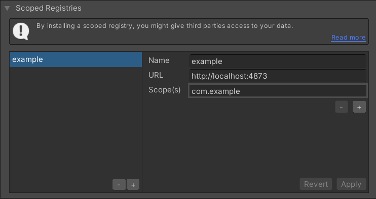
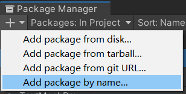
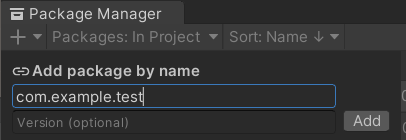

# Unity 私有仓库

# 安装

1. 安装 [nodejs](https://nodejs.org/en/download) 

 测试安装

   `cmd` 命令行输入 `npm` 测试是否安装成功

   ```shell
   > npm
   npm <command>
   
   Usage:
   
   npm install        install all the dependencies in your project
   ...
   ```

2. 安装 Verdaccio

[文档](https://verdaccio.org/docs/cli)

```
npm install -g verdaccio
```

3. 启动服务

```
verdaccio
```

测试安装成功, 浏览器打开 verdaccio主页 http://localhost:4873

4. 添加账号

```
npm adduser --registry http://localhost:4873
```

5. 登录

```
npm login
npm who am i
```

6. 发布包

```
cd <PackageDir>
npm publish --registry http://localhost:4873
```

# Unity 配置

## 添加仓库

1. Unity 选择菜单 `Windows/Package Manager` 打开 `Package Manager` 窗口
2. 菜单 `Advanced Project Settings` 打开 Package Manager 窗口


3. 添加私有仓库



- **Name** 显示名称 `thirdparty`
- **URL** 仓库服务地址，为 `verdaccio` 服务地址 `http://127.0.0.1:4873`
- **Scope(s)** 匹配的域名 `thirdparty`，通过域来过滤查找所属仓库地址

## 添加包

1. `Package Manager` 窗口点击 `+` 按钮，选择 `Add package by name` 





添加成功

